# 画像表現研究サンプルプログラム
武蔵野美術大学通信教育課程デザイン情報学科デザインシステムコース4年画像表現研究（2019年度）のサンプルプログラム

## 授業ページ
[web](https://scottallen.ws/mau/ie2019)

## Screenshots
### OpenCV/faceDetection
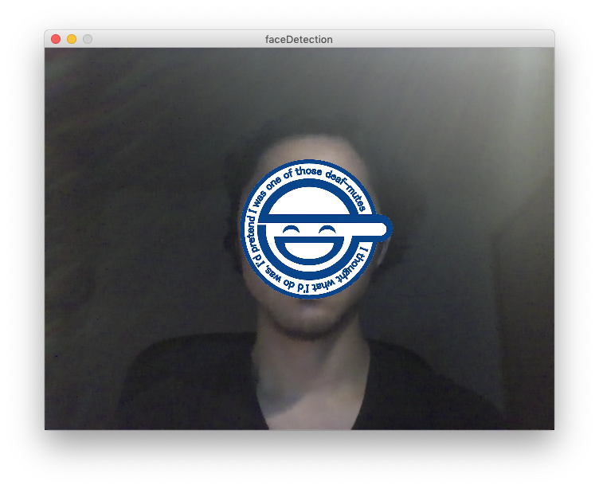

### OpenCV/brightestPoint
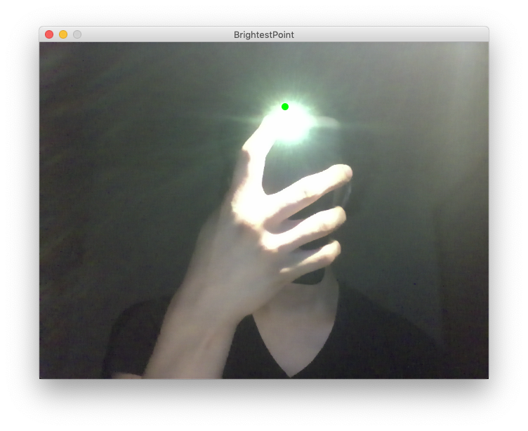

### OpenCV/brightestPointDRAWING
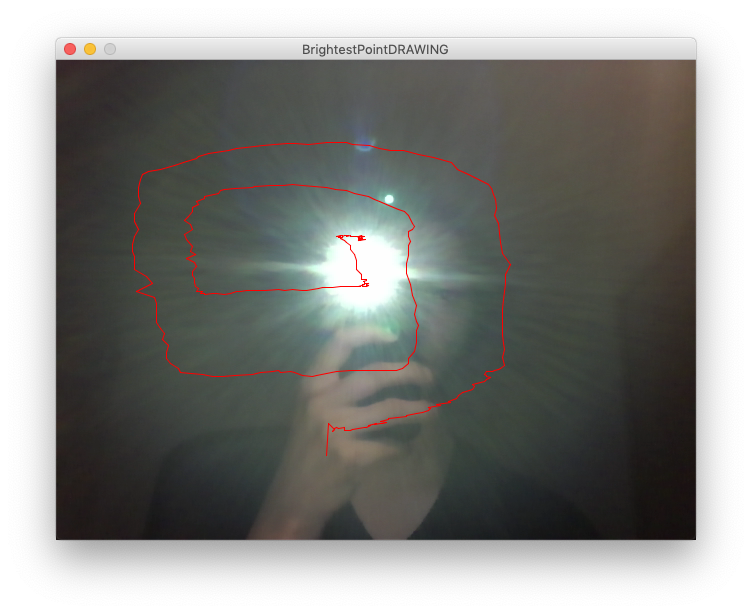

### OpenCV/opticalFlow
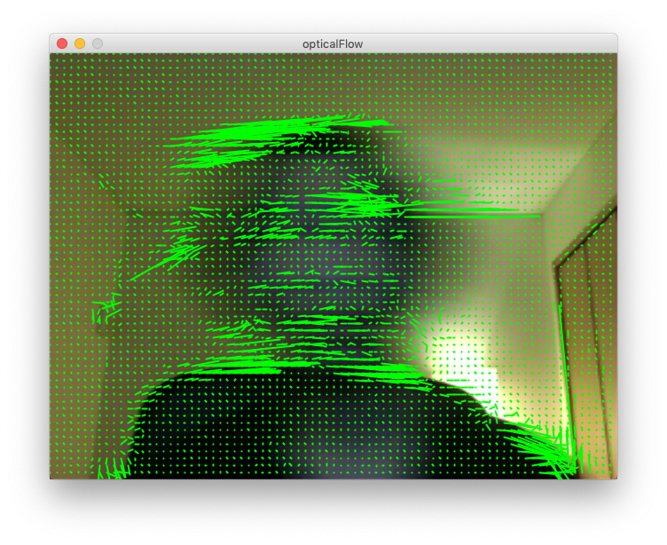

### OpenCV/opticalFlowParticleEmission
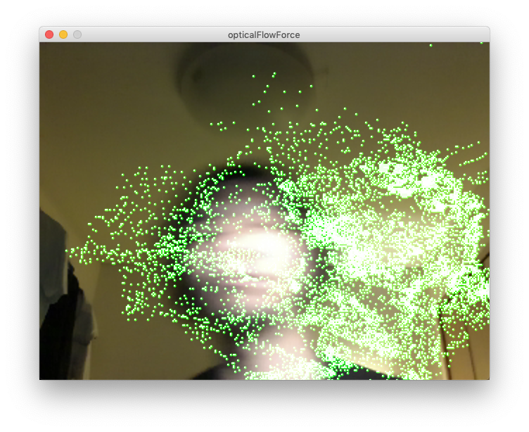

### AR/markerDetection
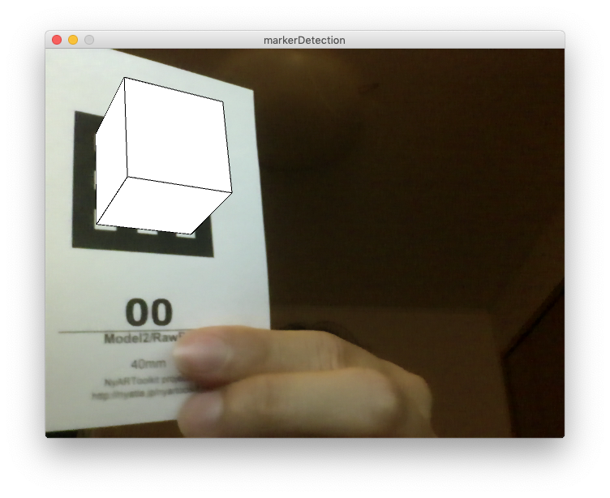

### AR/multiMarkerDetection
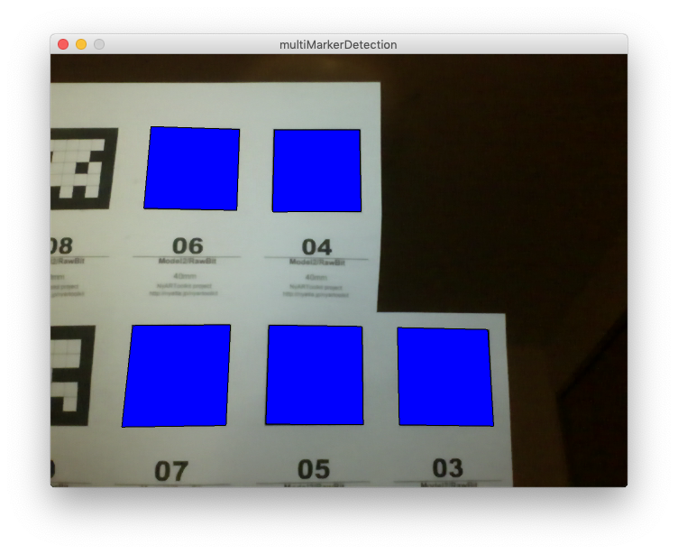

### AR/markerDetectionInstrument
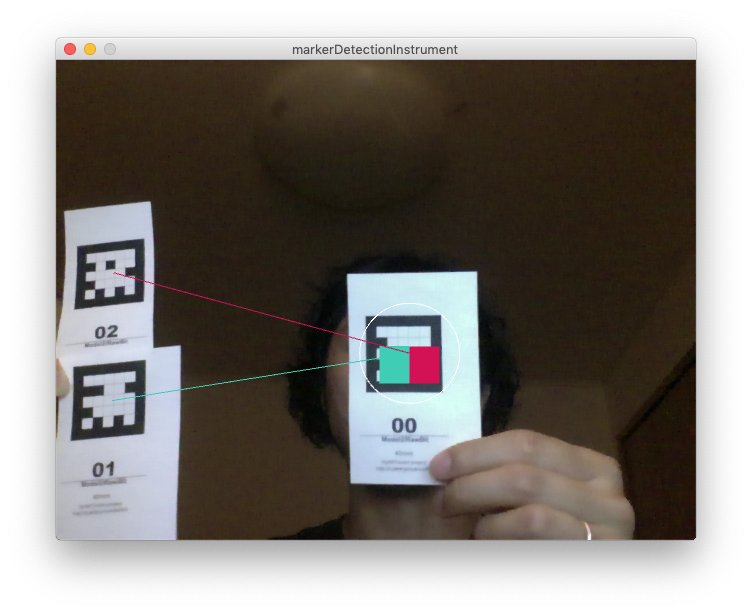

### time/timeStamp2
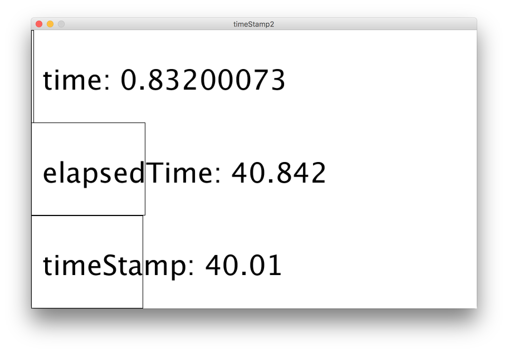

### time/exp
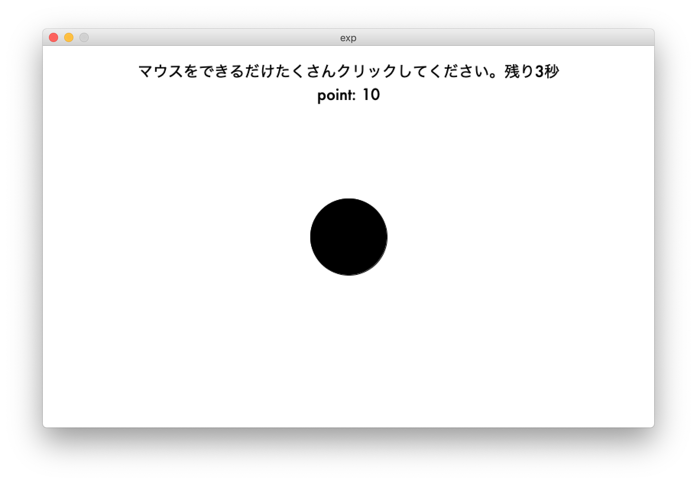

### projection/keyStone
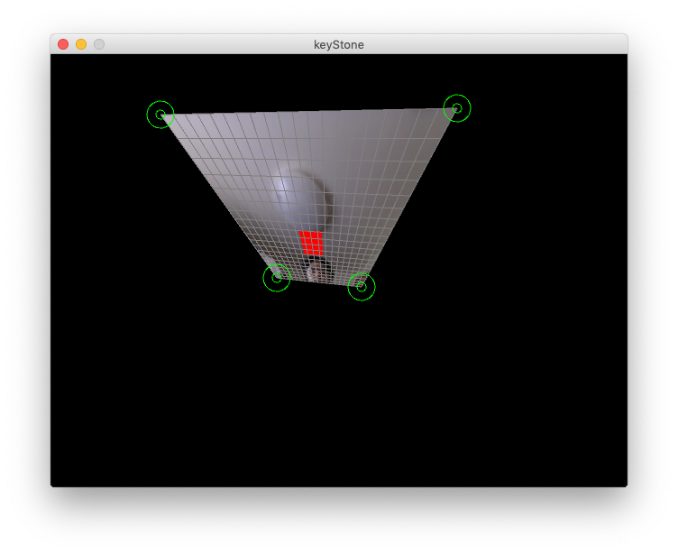
